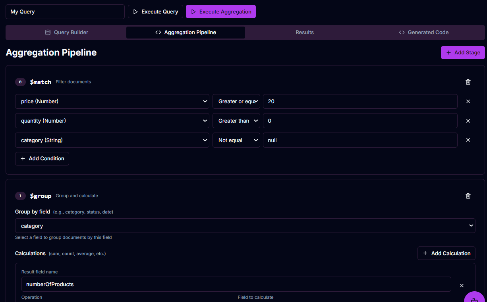

# Advanced E-commerce Aggregation Example

This example demonstrates a realistic MongoDB aggregation workflow in MongoFlow.

## Objective

Identify the top five product categories by total inventory value.

## Pipeline stages

1. `$match`: keep valid products with positive price and stock.
2. `$group`: group by category and compute product count, total units, average price, highest price, and total inventory value.
3. `$match`: remove categories with low product count or low total value.
4. `$project`: produce a readable output.
5. `$sort`: rank categories by total inventory value.
6. `$limit`: keep the top five categories.

## MongoDB Shell query

## Expected result

The output is a list of product categories ranked by total inventory value.